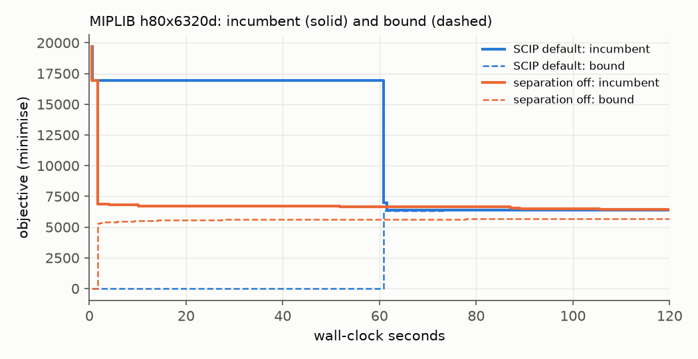

[← optopt](../) · [Tutorials](./)

# 1 · What a MIP solver does while it runs

A **mixed-integer program** (MIP) minimises a linear objective subject to linear constraints, where some variables must be
integers. Scheduling, routing, unit commitment and bin packing are all MIPs. Solvers such as HiGHS, SCIP and NVIDIA cuOpt
search a tree of subproblems (**branch-and-bound**), and at every moment they know two numbers:

- the **incumbent** — the best feasible solution found so far (an *upper* bound when minimising);
- the **bound** — a proof that no solution can be better than this value (a *lower* bound), from LP relaxations and cuts.

The **gap** between them shrinks during the run; when it reaches zero the incumbent is proven optimal. Practitioners often
stop long before that and care mostly about how *fast* a good incumbent appears.

The figure shows one MIPLIB instance (`h80x6320d`) solved twice by SCIP for 120 s. With its default settings SCIP spends
the first minute without improving its first solution; with **cut separation switched off** it finds a good solution
within seconds — yet the default ends slightly *better* at 120 s. Same solver, same problem, a different
*configuration*, and which one is "better" depends on whether you value being early or ending best (chapter 2).

| setting | first good incumbent | incumbent at 120 s |
|---|---|---|
| SCIP default | after ~61 s | 6 382 |
| SCIP, separation off | after ~2 s | 6 465 |

**Hands-on.** `python tutorials/examples/ex01_first_mip.py` builds a random set-cover problem and prints every incumbent
and the bound as SCIP and HiGHS find them.

**Try:** raise `rows`/`cols` in [`examples/common.py`](https://github.com/berkorbay/optopt/blob/main/tutorials/examples/common.py) to make the problem harder and watch the gap close more slowly.
