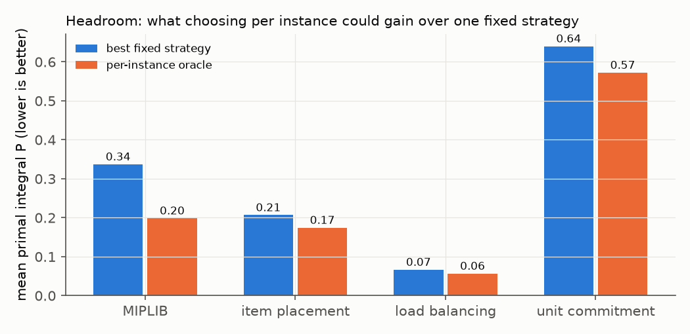

[← optopt](../) · [Tutorials](./)

# 3 · Portfolios, oracles and headroom

Give yourself a small **portfolio** of strategies (here six: HiGHS, SCIP and cuOpt, each at default and with a
primal-focused setting). Run all of them on every instance. Two reference points follow (Rice 1976; ASlib):

- **single best strategy (SBS)** — the one strategy with the best average; what you would use if you had to pick once;
- **per-instance oracle (VBS)** — the best strategy for each instance, chosen in hindsight.

The **headroom** (SBS − oracle) / SBS is the most any per-instance chooser could gain.

| family | best fixed strategy P | oracle P | headroom |
|---|---|---|---|
| MIPLIB (60 s) | 0.34 | 0.20 | 41 % |
| ML4CO item placement (30 s) | 0.21 | 0.17 | 16 % |
| ML4CO load balancing (30 s) | 0.07 | 0.06 | 15 % |
| PGLib-UC unit commitment (60 s) | 0.64 | 0.57 | 11 % |

These are instances where at least one strategy finds a solution. On 23 unit-commitment cases no strategy finds one in
60 s, so every strategy scores P = 1 there; counting them, unit commitment has 5 % headroom and all families together
19 % (25 % without them). Which instances you count changes the headline, so always say which.

**Beware the noisy oracle.** Solvers are randomised; the "best strategy for this instance" from one run is partly luck.
Choose the oracle's strategy on one seed and score it on another (**held-out seed**): on a 12-instance MIPLIB subset run
with five seeds, 83 % of the apparent headroom survives this test (the table above uses one seed).

**Closed gap** measures a learned chooser: 0 = no better than the SBS, 1 = as good as the oracle.

**Hands-on.** `python tutorials/examples/ex03_headroom.py` computes the SBS, the oracle and the headroom from the paper's own
MIPLIB runs (`datasets/runs.parquet`).

**Try:** compute the oracle on only the three *default* strategies — how much of the headroom is solver choice alone?
