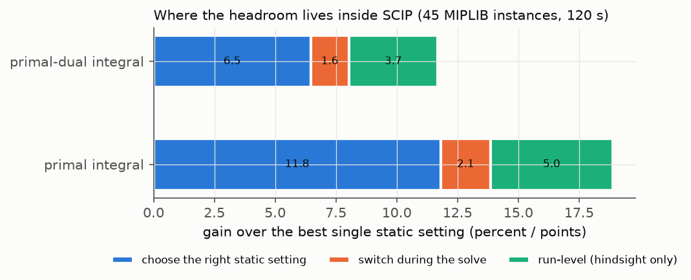

[← optopt](../) · [Tutorials](./)

# 4 · Choosing versus switching

If configurations matter, maybe the solver should change them **during** the run: start with aggressive heuristics, then
switch to proving; restart when stuck; change the branching rule after the first solution. SCIP allows all of this from a
callback. The paper tested it with six static settings and six mid-solve schedules on 45 MIPLIB instances.

The key step is to **split the headroom into parts**:

| part (gain over the best single static setting) | primal integral | primal-dual integral |
|---|---|---|
| choosing the right static setting per instance | 11.8 % (95 % CI 1.0…18.1) | 6.5 % (2.1…15.0) |
| switching during the solve, on top | 2.1 % (−0.4…7.3) | 1.6 % (−0.1…3.8) |
| gap to the per-run hindsight oracle | 5.0 % (0.9…11.4) | 3.7 % (1.6…6.6) |

Most of the value is in **choosing**; the six schedules tried add little on top. The third part is what knowing each
run's winner in advance would add: the best setting also depends on the particular run (random choices inside the
solver), and the predictors tried did not capture it. Other schedules or longer budgets might still gain from switching.

**Hands-on.** `python tutorials/examples/ex04_switching.py` compares default, separation off, a switch at 25 % and a restart
at 25 % on three generated problems.

**Try:** add your own schedule, e.g. `("HEU", "D", "stall20")` — aggressive heuristics until the search stalls for 20 % of the
budget (settings are in [`src/optopt/solvers/scip.py`](https://github.com/berkorbay/optopt/blob/main/src/optopt/solvers/scip.py), `SETTINGS`).
