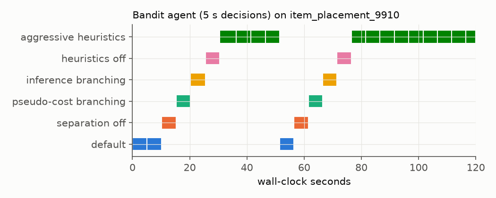

[← optopt](../) · [Tutorials](./)

# 5 · Agents in the loop

The end-to-end question: hand an **agent** a problem, a solver, a wall-clock budget and a fixed slice of the machine; it
starts from the defaults and may change settings or restart at any time. Everything it does — including its own
thinking time — counts against the budget.

In this repository the agent is called from inside SCIP every few seconds ([`src/optopt/agents/base.py`](https://github.com/berkorbay/optopt/blob/main/src/optopt/agents/base.py)) with the current state
(incumbent, bound, gap, time since the last new solution, node rate, current setting) and returns nothing, a setting, or a
restart. SCIP's time limit is wall clock, so slow agents pay for their slowness.

A simple and strong baseline is an **online bandit** (UCB1; Auer, Cesa-Bianchi & Fischer 2002): each interval it tries a
setting, rewards the gap progress it saw, and gradually prefers what works — no training data needed.

On unseen ML4CO item-placement problems the bandit improved the primal integral by about 30 % over SCIP's defaults. But a
*fixed* "aggressive heuristics" setting from the start was just as good (and better early on): the bandit was mostly
**discovering the right static setting online**, paying for the exploration.

| item placement, P(120) | value |
|---|---|
| SCIP default | 0.356 |
| bandit agent (5 s decisions) | 0.250 |
| fixed aggressive heuristics | 0.245 |

**When an agent acts matters.** A fixed setting is applied before the solve starts, so it also governs presolve; an agent
can only act when SCIP first calls it, a fraction of a second later. The paper therefore added a control that applies
the same fixed setting at that first call. A local language-model agent picked aggressive heuristics as its first move in
most runs, but the fixed setting applied at the same call beat it on 22 of 30 instances. On load balancing the reason
was mundane: set before the solve, aggressive heuristics also run one start-up heuristic that delays the first solution
by half a second. Always compare an agent with a control that acts at the same moment.

**Hands-on.** `python tutorials/examples/ex05_my_agent.py` defines a 10-line "stall agent" and runs it next to the bandit.

**Try:** write an agent that looks at `state["node_rate"]` and switches off cuts when nodes are slow.
