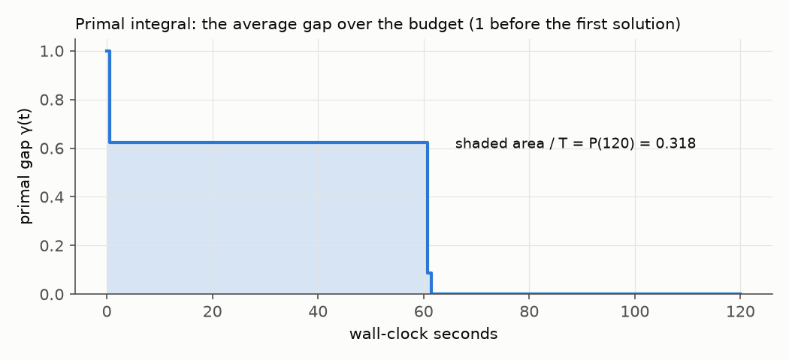

# 2 · Measuring "good solutions early"

Total solve time rewards only the end of the run. To reward finding good solutions *early*, we use the
**primal integral** (Berthold 2013). At each moment compute the **primal gap**

  γ(t) = |incumbent − best known| / max(|incumbent|, |best known|),   with γ = 1 before any solution exists,

then average it over the budget T: **P(T) = (1/T) ∫₀ᵀ γ(t) dt**. It lies in [0, 1]; lower is better. P = 0 means the
optimum was known from the first instant; P = 1 means nothing was found.

The shaded area divided by the budget is P. For the default run in chapter 1, P(120) = 0.318: most of the area comes from
the minute spent on a poor first solution, even though that run ends with the better incumbent.

| quantity | what it rewards | used for |
|---|---|---|
| primal integral P(T) | good solutions early | main metric in the paper |
| primal-dual integral PDI(T) | solutions *and* bound progress (uses the solver's bound instead of the best known value) | secondary |
| time to 1 % | the moment the incumbent is within 1 % of the best known value | practical summary |

Two details that matter in practice (both learned the hard way in this project): metrics are **cut at T**, so a solver
that overruns its time limit gains nothing; and an incumbent reported *better* than a proven optimum is treated as
invalid, because it can only come from a tolerance issue or a reporting error.

**Hands-on.** `python tutorials/examples/ex02_primal_integral.py` runs SCIP with two settings and prints P, PDI and time to
1 % for each. Code: `src/optopt/analysis/metrics.py` (and its tests in `tests/`).

**Try:** change the budget `T` and watch how the ranking of the two settings can flip.
