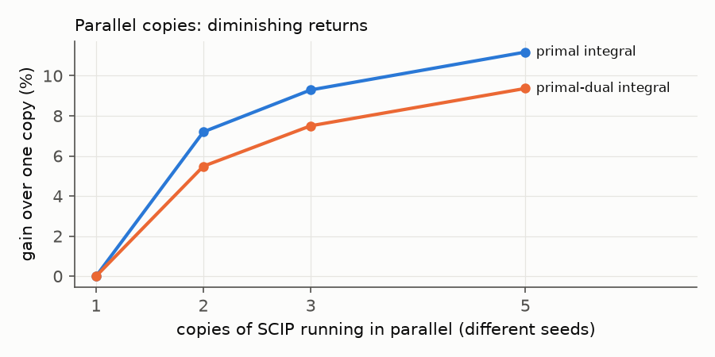

# 6 · Parallel copies and learned selectors

**Parallel copies.** If the best setting depends on the run, run several and keep the best — the *algorithm portfolio*
idea (Gomes & Selman 2001). On a DGX Spark a CPU solver and the GPU solver can run side by side: HiGHS on one thread next
to cuOpt captures about 80 % of the per-instance headroom with no model at all. Copies of SCIP that differ only in the
random seed also help, with diminishing returns:

| SCIP copies (different seeds) | 2 | 3 | 5 |
|---|---|---|---|
| gain in primal integral | 7 % | 9 % | 11 % |
| gain in primal-dual integral | 6 % | 10 % | 16 % |

Parallel copies use more compute; compare them with other uses of the same cores, not with a single run.

**Learned selectors.** Can a model read a problem and pick the right setting before the solve? The paper compares
gradient-boosted trees (LightGBM), a small neural network, and a 421M-parameter decision model (Laya), all reading 62
simple statistics of the problem. At a 10 s budget the best of them close about a quarter of the gap to the oracle; at
30 s none beats always using the single best strategy. Rule of thumb from the project: **if a simple model is as good,
use the simple model.**

**Where to go next:** [resources.md](resources.md), and the paper's appendix for every experiment that did not work.
